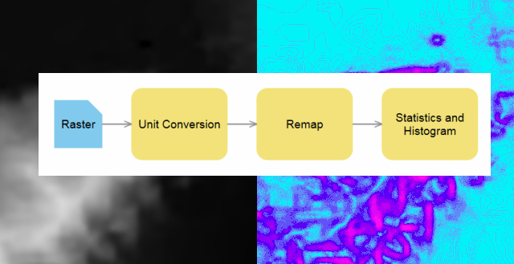

# solutions-raster-functions

Raster functions can be applied to raster datasets and mosaic datasets for fast, accurate analytic capabilities.

## Features

* The [**suitability**](./suitability/README.MD) folder contains:
  * Military Aspects of Weather functions
  
  Raster Functions included and what they do
  
DeriveHeatIndex.rft.xml								Raster function to calculate Heat Index using Relative Humidity and Temperature.
DeriveWindChillnonuv.rft.xml						Raster function to display windchill but not using u and v components of wind. Uses a single variable for wind speed and single variable for temperature .
DeriveWindChilluv.rft.xml							Raster function to display windchill using u and v components of wind. Uses a single variable for temperature.
ExtractCloudCeiling.rft.xml							Raster function to display cloud ceiling height from data.
ExtractCloudCover.rft.xml							Raster function to display percentage cloud cover from data.
ExtractGust.rft.xml									Raster function to display wind gust derived from u and v values of wind.
ExtractPrecipitationRate.rft.xml					Raster functions to display precipitation rate from data.
ExtractRelativeHumidity.rft.xml						Raster function to display relative humidity from data.
ExtractTemperature.rft.xml							Raster function to display temperature readings from data.
ExtractTemperatureDegC.rft.xml						Raster function to extract temperature from data and change from Degrees Kelvin to Degrees Centigrade.
ExtractVisibility.rft.xml							Raster function to display visibility values from data.
ExtractWindDirection.rft.xml						Raster function to display wind direction using u and v components of wind.
ExtractWindDirectionNonUV.rft.xml					Raster function display wind direction but not using u and v components of wind. Uses a single variable for wind speed.
OpImpactAirDefenseCloudCeiling.rft.xml				Raster function to display the operational impact of cloud ceiling values on air defense operations.
OpImpactAirDefenseTemperature.rft.xml				Raster function to display the operational impact of temperature values on air defense operations.
OpImpactAirDefenseVisibility.rft.xml				Raster function to display the operational impact of visibility values on air defense operations.
OpImpactAirDefenseWindSpeed.rft.xml					Raster function to display the operational impact of wind speed derived from u and v values on air defense operations.
OpImpactArtilleryCloudCeiling.rft.xml				Raster function to display the operational impact of cloud ceiling values on artillery operations.
OpImpactArtilleryVisibility.rft.xml					Raster function to display the operational impact of visibility values on artillery operations.
OpImpactArtilleryWindSpeed.rft.xml					Raster function to display the operational impact of wind speed derived from u and v values on artillery operations.
OpImpactBridgeCrossingWindSpeed.rft.xml				Raster function to display the operational impact of wind speed derived from u and v values on bridge crossing.
OpImpactCrossCountryManoevresCloudCeiling.rft.xml	Raster function to display the operational impact of cloud ceiling values on cross country manoeuvres.
OpImpactCrossCountryManoevresSnowDepth.rft.xml		Raster function to display the operational impact of snow depth values on cross country manoeuvres.
OpImpactCrossCountryManoevresTemperature.rft.xml	Raster function to display the operational impact of temperature values on cross country manoeuvres.
OpImpactCrossCountryManoevresVisibility.rft.xml		Raster function to display the operational impact of visibility values on cross country manoeuvres.
OpImpactCrossCountryManoevresWindSpeed.rft.xml		Raster function to display the operational impact of wind speed values derived from u and v values on cross country manoeuvres.
OpImpactParachuteCloudCeiling.rft.xml				Raster function to display the operational impact of cloud ceiling values on parachute operations.
OpImpactParachuteWindSpeed.rft.xml					Raster function to display the operational impact of wind speed values on parachute operations.
OpImpactPersonnelHeatIndex.rft.xml					Raster function to display the operational impact of heat index values on personnel.
OpImpactPersonnelTemperature.rft.xml				Raster function to display the operational impact of temperature values on personnel.
OpImpactUAVCloudCeiling.rft.xml						Raster function to display the operational impact of cloud ceiling values on UAV operations.
OpImpactUAVVisibility.rft.xml						Raster function to display the operational impact of visibility values on UAV operations.
OpImpactUAVWindSpeed.rft.xml						Raster function to display the operational impact of wind speed values on UAV operations.
TacticalAirliftCloudCeiling.rft.xml					Raster function to display the impact of cloud ceiling values on tactical airlifts.
TacticalAirliftVisibility.rft.xml					Raster function to display the impact of visibility values on tactical airlifts.

Python Scripts included and what they do

All of the scripts need to be checked by the user especially if it is intended to use them with different data as parameters may need to be changed to suit.
  
GustWindSpeedFromUV.py	 							Python script used by the ExtractGust raster function which uses U and V components of wind.
HeatIndex.py	 									Python script used by the DeriveHeatIndex raster function.
WindChillnonuv.py	 								Python script used by the DeriveWindChillnonuv raster function for data that does not contain the U and V components of wind.
WindchillUV.py	 									Python script used by the DeriveWindChilluv raster function for data that does contain the U and V components of wind.
WindDirectionFromUV.py	 							Python script used by the WindDirectionFromUV raster function.
WindSpeedFromUV.py	 								Python script used by the OpImpact wind speed raster functions.

  
  
  

## Sections

* [Requirements](#requirements)
* [Instructions](#instructions)
* [Resources](#resources)
* [Issues](#issues)
* [Contributing](#contributing)
* [Licensing](#licensing)

## Requirements

* ArcGIS Desktop 10.3 or later
* ArcGIS Pro v1 or later
* Pywin build 219 or later or similar ide.

## Instructions

### General Help

* [New to Github? Get started here.](http://htmlpreview.github.com/?https://github.com/Esri/esri.github.com/blob/master/help/esri-getting-to-know-github.html)
* [Getting started with image and raster processing](http://pro.arcgis.com/en/pro-app/help/data/imagery/get-started-with-image-and-raster-processing.htm)
* [Apply functions to a dataset](http://pro.arcgis.com/en/pro-app/help/data/imagery/apply-functions-to-a-dataset.htm)

### Getting Started

* Download the solutions-raster-functions repo to your local computer.
* These raster functions are designed to be work with mosaic datasets only and only with NAM data in the OpenDAP format.  If the user wants to use other data formats then the raster functions and associated Python scripts will have to be edited.  These Raster Functions enable the user to take a multi attribute raster and to display specific attributes from it such as Windspeed, Relative Humidity and Temperature. In addition to this any raster Functions that involves Python Scripts, Python raster Functions, enable the user to create and display a derived variable such as wind chill (calculated by combining Air Temperature and Windspeed).  The functions within this repo are there as a demo to the user and both types can be customized by the user so that they are able to display their own variables.
* Information on building raster functions can be found  here (https://github.com/Esri/raster-functions/wiki) and here (https://github.com/Esri/raster-functions) and here for Python raster functions (https://github.com/Esri/raster-functions/wiki/PythonRasterFunction)
* They have been built with NAM CONUS (12KM) downloaded in the OpenDAP format obtained from here (http://nomads.ncep.noaa.gov/)
* All raster functions and scripts should be copied to a folder on a local drive on your computer.
* For the raster functions that use Python scripts such as DeriveWindChillUV.rft.xml the location of the Python script will have to be changed.  This can be done in 2 ways
	* It can be edited directly within xml by finding the .py file and changing the location.
	* It can be edited within ArcGIS through the Raster Function editor and double clicking on Python module name.
* With ArcGIS Desktop 10.3
	* Add the raster functions to the mosaic dataset as processing templates.
	* Add mosaic dataset to project and then apply relevant processing template.
* With ArcGIS Pro:
	* The Mosaic dataset needs to be within a database within the databases section.
	* The Set Mosaic Dataset Properties geoprocessing tool then needs to be run.
	* Under the Image Processing the tab the Raster Functions should be added as Processing templates one by one.
	* To run them within ArcGIS Pro 1st select the layer you want apply it to from the table of contents then select Mosaic Layer - Data from the ribbon bar at the top and select the relevant Raster Function from the processing templates drop down.

## Resources

* [ArcGIS Pro](https://pro.arcgis.com/en/pro-app/community/)

## Issues

Find a bug or want to request a new function?  Please let us know by submitting an issue.

## Contributing

Esri welcomes contributions from anyone and everyone. Please see our [guidelines for contributing](https://github.com/esri/contributing).

## Licensing

Copyright 2015 Esri

Licensed under the Apache License, Version 2.0 (the "License");
you may not use this file except in compliance with the License.
You may obtain a copy of the License at

   [http://www.apache.org/licenses/LICENSE-2.0](http://www.apache.org/licenses/LICENSE-2.0)

Unless required by applicable law or agreed to in writing, software
distributed under the License is distributed on an "AS IS" BASIS,
WITHOUT WARRANTIES OR CONDITIONS OF ANY KIND, either express or implied.
See the License for the specific language governing permissions and
limitations under the License.

A copy of the license is available in the repository's
[license.txt](license.txt) file.

